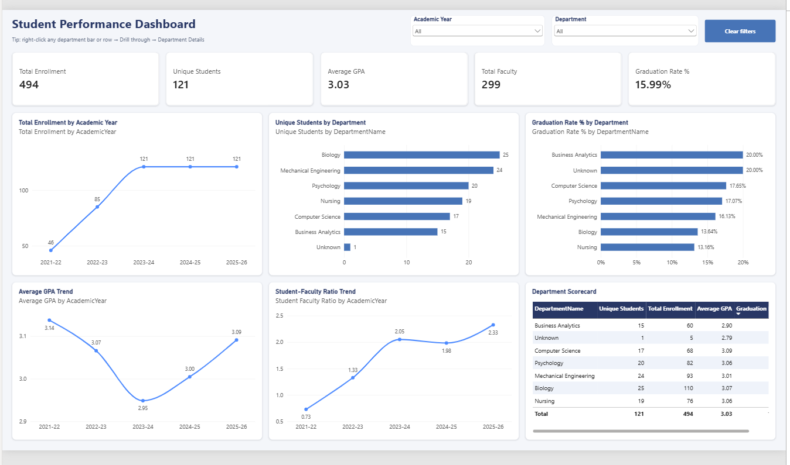

# Student Performance Dashboard (Power BI)

An interactive Power BI dashboard for analyzing student enrollment, academic performance, graduation outcomes and faculty capacity across departments and academic years.

## Key Questions Answered

- How has total enrollment changed across academic years?
- Which departments have the most students and the highest graduation rates?
- How is the average GPA trending over time?
- Is the student-to-faculty ratio improving or getting worse?

## Features

**Overview page**
- KPI cards: Total Enrollment, Unique Students, Average GPA, Total Faculty, Graduation Rate %
- Dropdown slicers for Academic Year and Department, plus a one-click **Clear filters** button
- Trend charts for enrollment, average GPA and student-faculty ratio
- Department comparisons for student count and graduation rate
- Department Scorecard table that cross-filters every other visual

**Department Details page (drill-through)**
- Right-click any department → *Drill through* → *Department Details*
- Department-specific KPIs and year-over-year trends for enrollment, GPA and graduation rate
- Back button to return to the overview

## Data Model

Star schema with five tables:

| Table | Type | Description |
|---|---|---|
| `EnrollmentTable` | Fact | Student enrollment records, GPA and graduation status |
| `FacultyTable` | Fact | Faculty records used for capacity metrics |
| `StudentsTable` | Dimension | Student attributes |
| `DepartmentsTable` | Dimension | Department names |
| `DimAcademicYear` | Dimension | Academic year calendar |

### DAX Measures
`Total Enrollment`, `Unique Students`, `Average GPA`, `Graduation Rate %`, `Total Faculty`, `Student Faculty Ratio`

## Tools & Skills

Power BI Desktop · Power Query · Data Modeling (star schema) · DAX · Interactive report design (slicers, drill-through, cross-filtering)

## How to Use

1. Download `Student_dashboard_interactive.pbix`
2. Open it in [Power BI Desktop](https://powerbi.microsoft.com/desktop/) (free)
3. Use the slicers at the top, click any chart to cross-filter, or right-click a department to drill through

## Author

**Rajeev Varma Indukuri**
